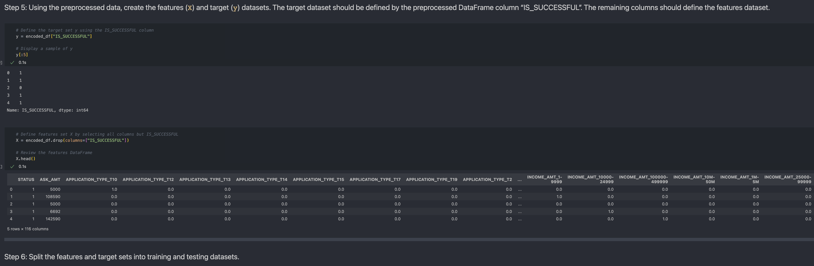
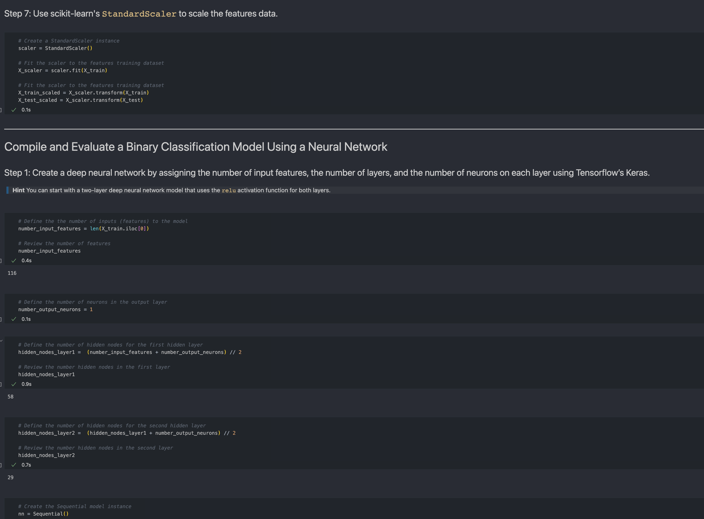
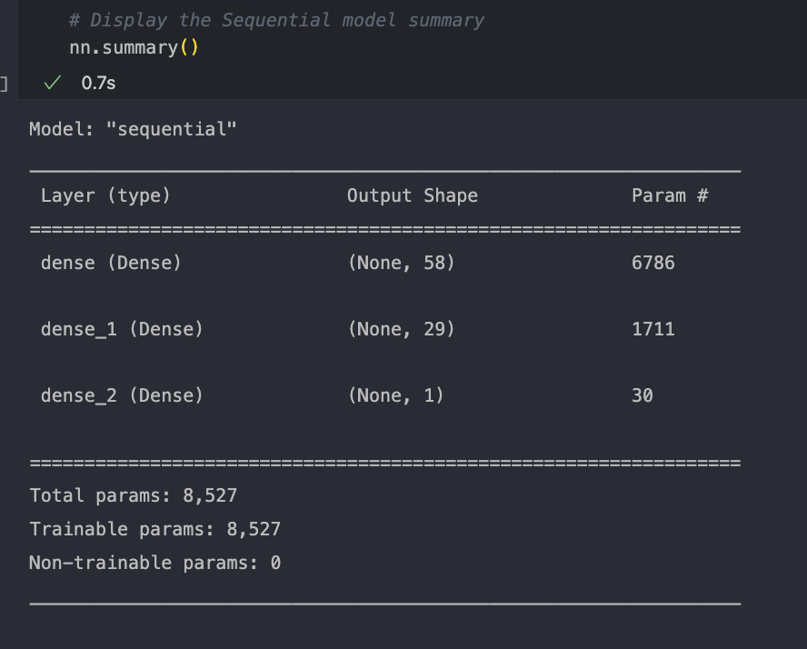
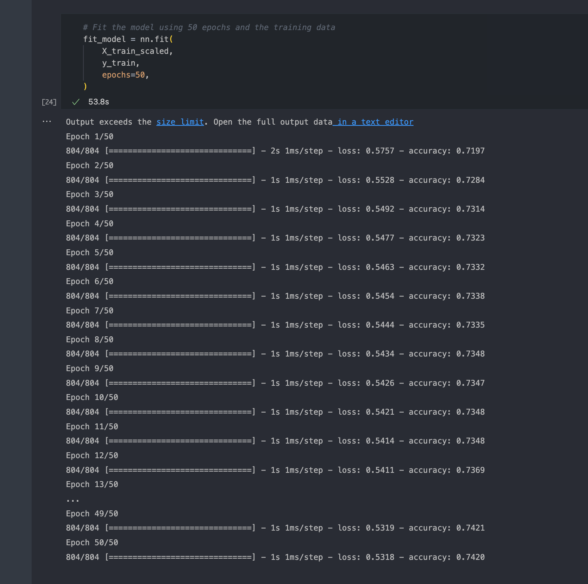
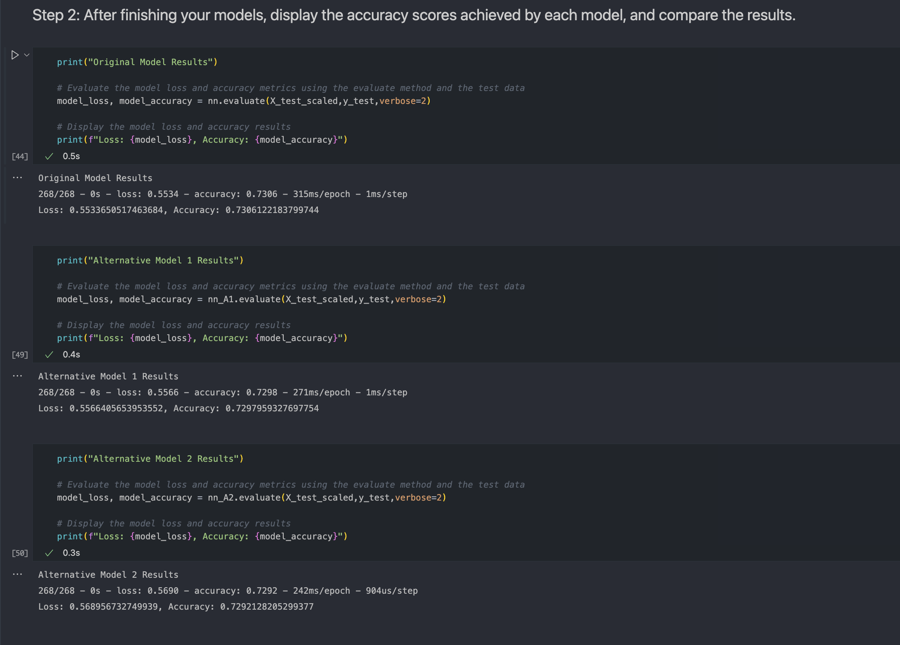

`DEEP-LEARNING` *team has asked you to help them create a `model`that **predicts** whether applicants will be successful if funded by Alphabet Soup*.
*The business team has given you a CSV file containing more than 34,000 organizations that have received funding from Alphabet Soup over the years. The CSV file contains a variety of information about each business, including whether or not it ultimately became successful. With your knowledge of `machine learning` and **neural networks**, you decide to use the features in the provided dataset to create a binary classifier model that will predict whether an applicant will become a successful business*.

[CLICK HERE](https://news.mit.edu/2017/explained-neural-networks-deep-learning-0414) to learn more about `neural networks` 🧠

## `DEEP-LEARNING`

# Step 1

Preprocess Data For Neural Network Model

[CLICK HERE](https://www.v7labs.com/blog/data-preprocessing-guide) to learn more abourt Preprocess data 

# STEP 2 

 Compile and Evaluate a Binary Classification Model
    

Model Structure `SUMMARY`

# STEP 3 
 Model-Fit-Predict Pattern 

 > A total of three model was performed 

# STEP 4

EVALUATE 

> Original model performed better out of the three models

## REQUIRMENTS

[tensorflow](https://www.tensorflow.org)

[scikit-learn](https://scikit-learn.org/stable/)

[pandas](https://pandas.pydata.org)

## INSTALLATION

[ZIP FILE](https://github.com/brprod8/DEEP-LEARNING/archive/refs/heads/main.zip)

[CLONE REPO](https://github.com/brprod8/DEEP-LEARNING.git)

## LICENSE

**Open to Experiemnt**

BY:Robert Smith

Credit:UC BERKELEY

Email : Roberts.track@yahoo.com

